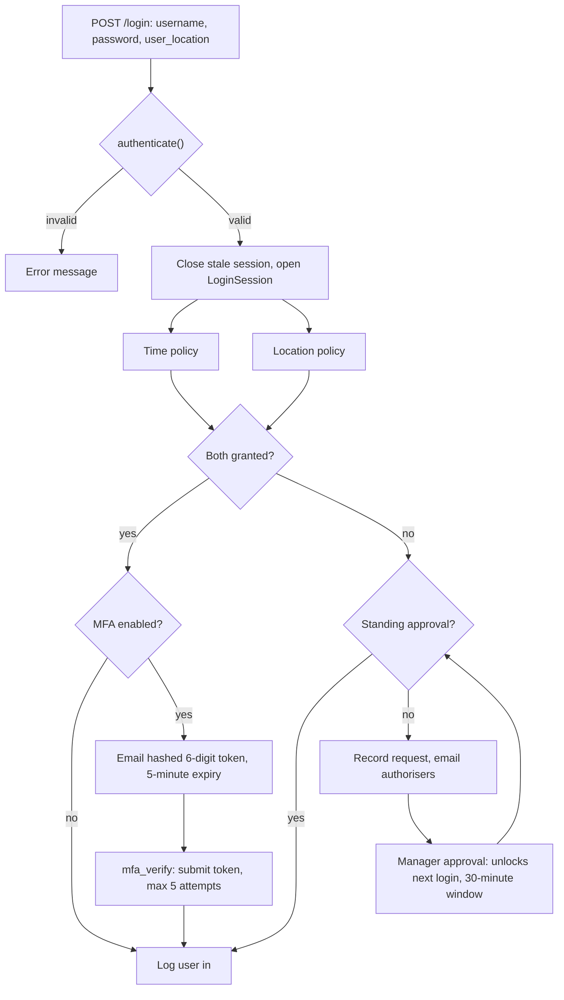

# Context-Aware MFA & Access Control

A Django authentication layer that decides how far to trust a login based on *context*, not just credentials. After the password check, a login is evaluated against two contextual policies: **where** the user is and **when** they are logging in, and then passes through an email one-time-token (MFA) step. Logins that fail the contextual checks are not simply rejected: they are escalated to a manager for a human decision, and an approval unlocks exactly one follow-up login, for a limited window.

> **About this repository.** This is a reconstructed, representative implementation of an access-control subsystem originally built for a production transport management system. Proprietary code, data and business rules are not included. It contains the authentication domain logic only (models, views, forms, helpers). Project settings, templates and migrations are omitted, so template paths and redirect targets in the views are placeholders. It's designed to be dropped into an existing Django project and adapted to fit smoothly, see **Integration points** below for what that involves.

---

## What it does

1. Authenticates username and password with Django's `authenticate()`.
2. Records a `LoginSession` (timestamp, browser-reported coordinates, client IP), closing any session left open from before.
3. Applies a **time policy**: an optional per-user shift window, handling both same-day and overnight shifts.
4. Applies a **location policy**: haversine distance from the user's reported position to a set of manager-approved locations.
5. If both policies pass, sends a 6-digit email token when MFA is enabled for the user, otherwise logs them in.
6. If either policy fails, checks for a standing manager approval; if there isn't one, emails every authoriser with the failure reasons and an approval link, and records the request.

## Login flow



## Repository layout

The code imports from `apps.user_profile` and `apps.authentication`, so it is expected to sit inside an `apps/` package.

```
authentication/          Location policy management and approval workflow
├── models.py            AuthorisedLocation
├── forms.py             NewAuthorisedLocationForm (radius validated 0–5 miles)
├── geocoding.py          Address-to-coordinates lookup (Google Maps), isolated from the view
├── permissions.py        can_authenticate_users / can_approve_locations: integration seam
├── views.py             Create/edit locations (geocoded on save), approve locations, authorise pending users
├── tables.py            List views: authorised locations, users pending authentication
└── urls.py

user_profile/            Identity, session tracking and the login pipeline
├── models.py            Profile (MFA + policy settings), LoginSession
├── views.py             login, mfa_verify, logout
├── utils.py             Haversine distance, shift-window check, MFA token handling, approval state, authorisation-request email
└── urls.py
```

## Data model

**`Profile`**: one-to-one extension of Django's `User`. Holds the per-user security settings:

| Field | Purpose |
|---|---|
| `mfa_enabled`, `mfa_secret`, `mfa_token_expires`, `mfa_attempts` | MFA switch, the current token's *hash*, its expiry, and a failed-attempt counter |
| `time_restricted_access`, `shift_start_time`, `shift_end_time` | Optional working-hours window (same-day or overnight) |
| `is_authorised` | Whether the user has been approved to use the system |
| `authorised_to_authenticate_users` | Marks users who receive and can act on login-approval requests |
| `authorised_to_approve_authorised_locations` | Marks users who can approve a new `AuthorisedLocation` |
| `custom_authorised_location_set` | Flags users with their own locations |
| `current_session_authorisation` | `Granted` / `Logged Out` state of the current session |
| `login_approval_requested_at`, `login_approved_until` | State for a pending or granted manager approval |
| `password_last_changed` | Timestamp for password-age policies |

**`LoginSession`**: an audit record per login: created/closed timestamps, `Active`/`Closed` status, submitted coordinates and client IP.

**`AuthorisedLocation`**: a named place with address fields, geocoded `coordinates` (`"lat,lng"`), a `radius` in miles (0–5), a `user_specific` flag with an optional `user` foreign key, and an `approved_by_manager` flag. Only approved locations count toward the geofence.

## Policy details

**Time policy.** Applies only when `time_restricted_access` is set and both shift times exist; otherwise access is granted. The check compares local time of day against the shift window and correctly handles overnight shifts (e.g. 22:00–06:00).

**Location policy.** The login form carries a hidden `user_location` field, populated with the browser's geolocation on page load, and submitted as `"lat,lng"`. It's compared against each of the user's manager-approved locations (global, plus any of their own) using haversine distance in miles. Malformed or missing coordinates are treated as a failed check rather than a fail-open pass. Locations are geocoded once, on save, through the Google Maps Geocoding API; a login itself makes no external API call.

**MFA.** A 6-digit code, generated with `secrets` and stored only as a salted hash, is emailed (plain-text and HTML bodies) and expires after 5 minutes. Verification uses a constant-time comparison and is capped at 5 attempts before the user is sent back to log in for a fresh code. The pending login is tracked in the session, not the URL, so the verify step can't be reached without first passing the password check.

**Approval requests.** On a policy failure, the system first checks for a still-valid manager approval and, if present, consumes it and logs the user in. Otherwise it records the request time and emails every profile with `authorised_to_authenticate_users=True`, naming the user, the failure reasons, and an approval link built from the URL name (not a hardcoded path). Approving a user grants a single login within a 30-minute window (`LOGIN_APPROVAL_WINDOW_MINUTES`, default 30).

**Audit trail.** Each login records the submitted coordinates and the client IP (taken from `X-Forwarded-For` when present).

## Design decisions and trade-offs

- **Escalate rather than deny.** A failed contextual check goes to a human instead of locking the user out, so legitimate exceptions (covering a shift, working from a new site) don't need an administrator to edit their profile first.
- **Approval is single-use and time-boxed.** A grant unlocks the next login attempt only, for a limited window, rather than standing indefinitely: an approval for one exception shouldn't quietly authorise every future login too.
- **Client-reported location is a signal, not proof.** Browser geolocation can be spoofed. Recording the IP alongside the coordinates gives reviewers a second data point rather than relying on one.
- **Geocode once, compare offline.** Storing coordinates on the location avoids per-login API calls, cost and an availability dependency on Google.
- **Email tokens over an authenticator app.** No enrolment step, at the cost of the mailbox becoming the trust boundary.
- **Single active session per user.** A new login closes the previous session, keeping the audit trail unambiguous.
- **Minimal built-in authorisation, by design.** See Integration points below.

## Integration points

This module is meant to be dropped into a host project and adapted to its own permissions system, not to carry its own. A few seams are deliberately thin:

- **`authentication/permissions.py`**: `can_authenticate_users(user)` and `can_approve_locations(user)` are the only place this app decides who may act on approval requests. They currently read flags on `Profile`; a host project can rewrite them to check its own groups or permission classes (e.g. `user.has_perm(...)`) without touching the views that call them. `@login_required` is applied independently of these, so authentication is never optional even where authorisation is left to the host.
- **`AuthorisedLocation.approved_by_manager`** and the login-approval flow are core to what this module does, not integration points: they're what makes the geofence and the escalation path meaningful, and are enforced regardless of how a host wires up permissions.
- **Rate limiting** beyond the 5-attempt MFA cap (e.g. per-IP or per-account throttling on the login view itself) is left to the host, typically via middleware or a package like `django-axes`.
- **`Profile` creation** for each new `User` (e.g. a `post_save` signal) isn't included, since hosts usually already have their own user-provisioning flow to hook into.

## Dependencies and configuration

```
pip install django googlemaps haversine
```

- Django email settings (`EMAIL_HOST`, `EMAIL_HOST_USER`, etc.); `EMAIL_HOST_USER` is used as the MFA sender.
- `GOOGLE_MAPS_API_KEY`, read from settings/environment: used only when saving or editing an `AuthorisedLocation`.
- `SECRET_KEY`: used as a pepper when hashing MFA tokens (standard Django setting, not extra configuration).
- `LOGIN_APPROVAL_WINDOW_MINUTES` (optional, default `30`): how long a granted approval remains usable.
- A login template that includes the hidden `user_location` input and populates it via `navigator.geolocation`.
- A mechanism to create a `Profile` for each new `User` (for example a `post_save` signal); none is included here.